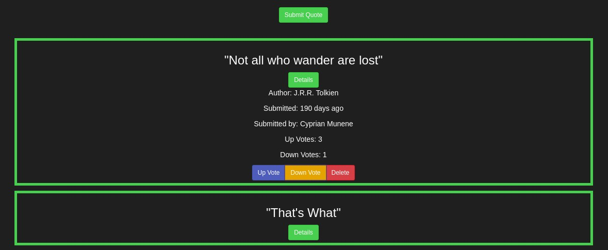

# Mercurial Quotes

The following is an Angular project that allows users to post, upvote and downvote a quote. The site also allows users to delete a selected quote and also view the quote with the highest number of upvotes

This project was generated with [Angular CLI](https://github.com/angular/angular-cli) version 7.1.4.
## Development

Run `ng serve` for a dev server. Navigate to `http://localhost:4200/`. The app will automatically reload if you change any of the source files. The deployed page looks as follows:

## Contributing

Any contributions to this projects will be greatly appreciated. If you want to contribute to it, here are the suggested instructions:
* Clone this GitHub repository to your local machine.
* Make your contributions.
* Email me the zipped project at munenecyp@gmail.com , or
* Request permissions to post your contribution at my GitHub repository through the same email address.

Alternatively, you could email the main developer at munenecyp@gmail.com with ideas on how this project could be more effective, efficient or beneficial.

## Versioning
Used GIT and GitHub. There are commits attached to the entire project to show the management of versions.

## Authors

 Cyprian Munene, any other contributor after the completion of the work can be viewed at this GitHub repository

## Copyright

All Rights Reserved by [@MercurialMune](https://github.com/MercurialMune)
Other GitHub can however fork or clone this repository provided the necessary credit is given to the original author
## License

This project is licensed under the MIT License. Moringa School moreover retains certain rights to elements in the code of this program.

## Acknowledgments

* Hat tip to anyone whose code was used
* Inspiration
* MORINGA TMs
